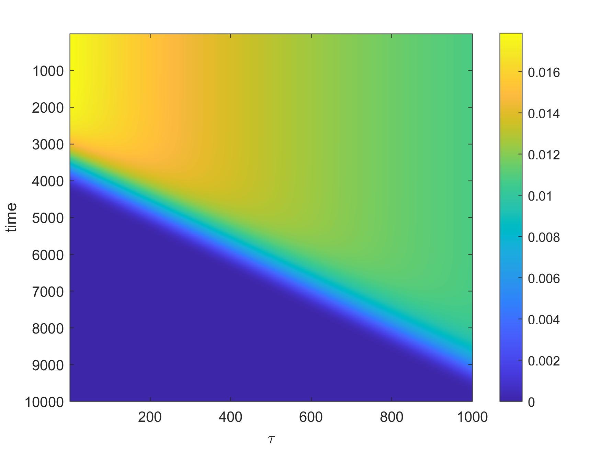
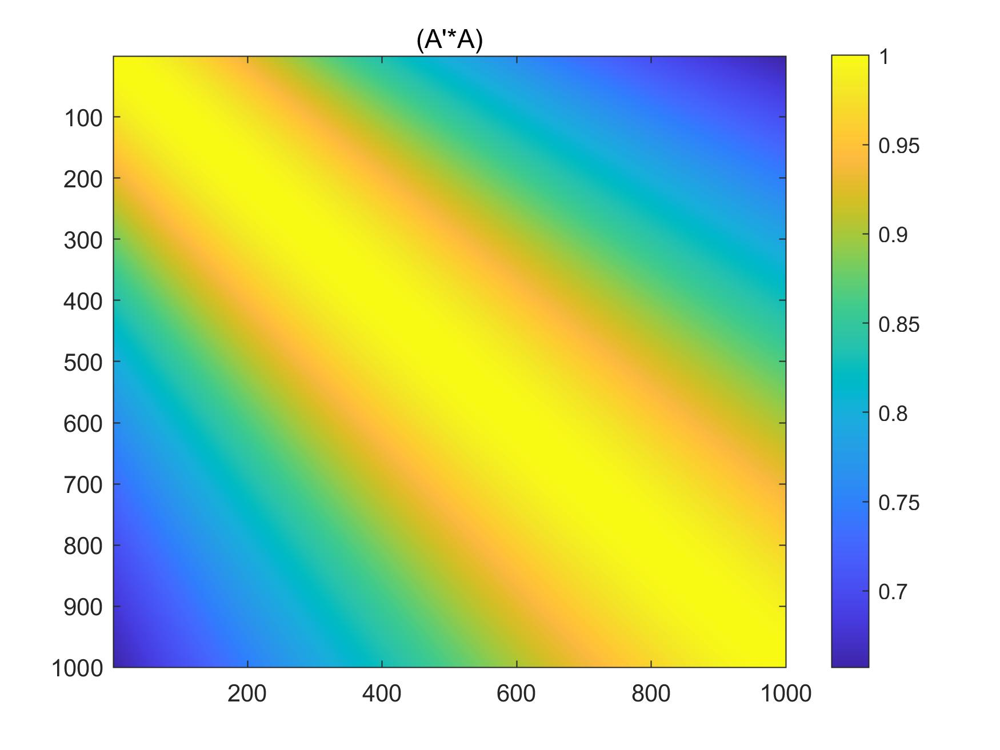
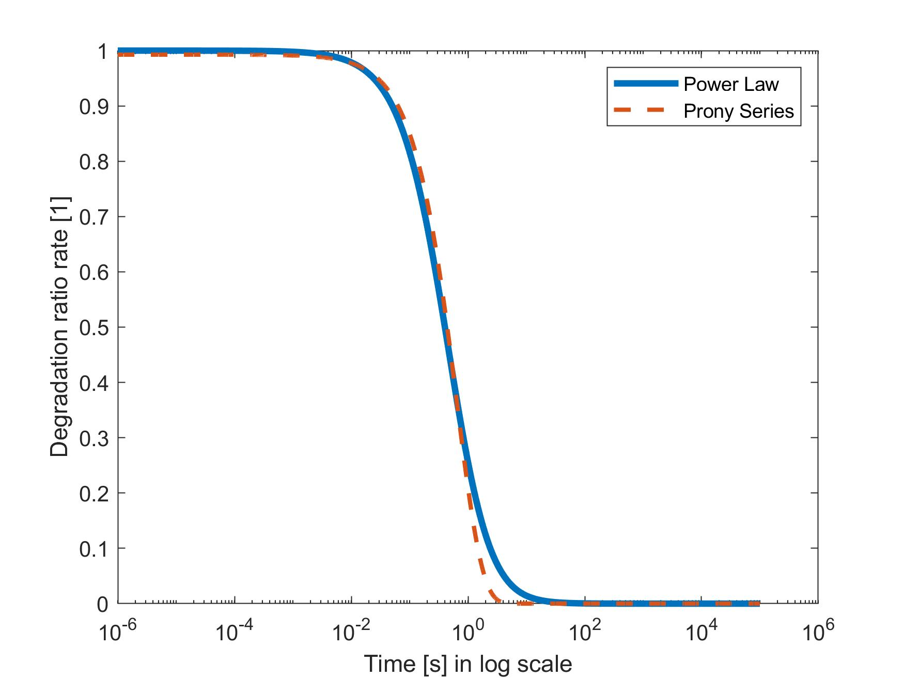

# Introduction
Viscosity of physic network stems from its physic bonds, which can connect and disconnect even subject to thermal fluctuation. The community of multi-scale modeling are bridging micro-scale kinetics of network (formation and degradation) to macro-scale, time-dependent "elastic" behavior.

# Prony Series
Different to kinetics of chemical reaction, which is presented by first order reaction, second order reaction or pseudo-second reaction. degradation rate is reported to follow power law [^long]:

[^long]: Long, R., Mayumi, K., Creton, C., Narita, T., & Hui, C.-Y. (2014). Time Dependent Behavior of a Dual Cross-Link Self-Healing Gel: Theory and Experiments. Macromolecules, 47(20), 7243–7250. https://doi.org/10.1021/ma501290h


$$
r^d = (1+(\alpha-1)\frac{t}{t_B})^{1/(1-\alpha)}
$$

```matlab
F = (1+(alpha-1)*time_series/tB).^(1/(1-alpha))';
energy = norm(F,2)^2;
```
where $r^d$ is the degradation ratio rate in unit of $[1]$ , $\alpha$ is the material-specific parameter, and $t_B$ is the characteristic time.

However, the power law poses an expensive storage and computation when we convolute elastic energy. Prony Series are good alternatives to the power law: its first time derivatives is proportional to itself. The property of Prony Series convert the integration on history values into an ODE problem, which depends only on current configuration.

The degradation ratio rate $r^d$ can be approximated by Prony Series:
$$r^d 	\approx \sum_n g^{(n)}e^{-t/\tau^{(n)}}$$

However, a set of Prony Series is redundant. 
For $m \neq n$, on finite timer interval,
$$ \int e^{-t/\tau^{(n)}}e^{-t/\tau^{(m)}}dt \neq0$$
Here comes a problem of sparse decomposition. Two problems are concerned:
1. how to seed time nodes?
2. which algorithm to apply?
   
The first question--how to seed time nodes--is simple but usually ignored by researches. x-axis in log scale is an usual way to evaluate the approximation. Sampling with a constant time interval cannot work well for it overweights the early time nodes; underweights the later times nodes. Seeding in a logarithmic scale is a good way to avoid this problem.

```matlab
time_series = logspace(-6,5,10000);
```

# Generating dictionary
```matlab
tau = logspace(-2,4,1000);
A = zeros(length(time_series),length(tau));
for ii = 1:length(tau)
    A(:,ii) = exp(-time_series/tau(ii));
    norm_2(ii) = norm(A(:,ii),2);
    A(:,ii) = A(:,ii)/norm_2(ii);
end
```
## Dictionary properties



# Algorithm
Which algorithm to apply? Accuracy and sparsity are needed. The need for sparsity excludes the algorithm such as Simplex Algorithm and Genetic Algorithm. Hard threshold, matching pursuit and basis pursuit are discussed in following part.

## Matching pursuit
```matlab
function alpha_tri_MP = matchingpursuit(signal,dictionary)
x = zeros(length(signal),1);
r = signal;
M = size(dictionary,2);
alpha_tri_MP = zeros(M,1);
energy = norm(signal,2)^2;
seuil = 1/600;
I_MAX = size(dictionary,2);
error=zeros(1,I_MAX);
count = 0;
while true
    alpha = dictionary'*r;
    [~,index] = sort(abs(abs(alpha)),'desc');
    alpha_tri_MP(index(1)) = alpha(index(1));
    x = x + dictionary(:,index(1))*alpha_tri_MP(index(1));
    r = signal - x;
    count = count + 1;
    error(count)= norm(r,2)^2;
    if count>I_MAX || error(count)<seuil*energy
        break
    end
end
if error(count)<seuil*energy
    disp('Found')
else
    disp('Not Found')
end
alpha_tri_MP = sparse(alpha_tri_MP);
end
```

## Hard threshold
Hard threshold is not optional. The dictionary is redundant rather than orthogonal, the coefficients are almost the same and large. But we still put the code here for reference

```matlab
function alpha_tri_SD = hardthresholding(signal,dictionary)
%seuillage dur
alpha = dictionary'*signal;
[~,index] = sort(abs(alpha),'desc');%must use index, because some alphas are of the same values.
M = size(dictionary,2);
alpha_tri_SD = zeros(M,1);

P_MAX = size(dictionary,2);
p_vec = 1:P_MAX;
error = zeros(1,length(p_vec));
energy = norm(signal,2)^2;
seuil = 1/1000;
for P = p_vec
    alpha_tri_SD(index(1:P)) = alpha(index(1:P));
    s_rc = dictionary*alpha_tri_SD;
    error(P) = norm(s_rc-signal,2)^2;
    if error(P)<seuil*energy
        disp('Found')
        break
    end
end
if error(P)<seuil*energy
     disp('Found')
else
    disp('Not Found')
end
alpha_tri_SD = sparse(alpha_tri_SD);
plot(p_vec,error)
xlabel('P')
ylabel('error')
end
```

## Basis pursuit
Basis pursuit will introduce another parameter to impose sparsity (0 norm or its equivalence) (if Lagrangian multiplier is applied). Setting hyperparameters remain empirical.

For example, on the cyber-defense of the work [^Laura]

[^Laura]: Flaschel, M., Kumar, S., & De Lorenzis, L. (2021). Unsupervised discovery of interpretable hyperelastic constitutive laws. Computer Methods in Applied Mechanics and Engineering, 381, 113852. https://doi.org/10.1016/j.cma.2021.113852

<blockquote class="twitter-tweet"><p lang="en" dir="ltr">Hi Changxu, thanks for your interest. The balancing factor and the exponent of the sparse regularization term are set empirically. The coefficient of the sparse regularization term is set based on physics constraints as shown in Sec 2.6.2 of the paper.</p>&mdash; Laura De Lorenzis (@LDeLorenzisETHZ) <a href="https://twitter.com/LDeLorenzisETHZ/status/1463792741901549577?ref_src=twsrc%5Etfw">November 25, 2021</a></blockquote> <script async src="https://platform.twitter.com/widgets.js" charset="utf-8"></script>

# Example
| $g^{(n)}$ | $\tau^{(n)}$ |
| --- | --- |
| $0.9928$ |$0.6424$|


